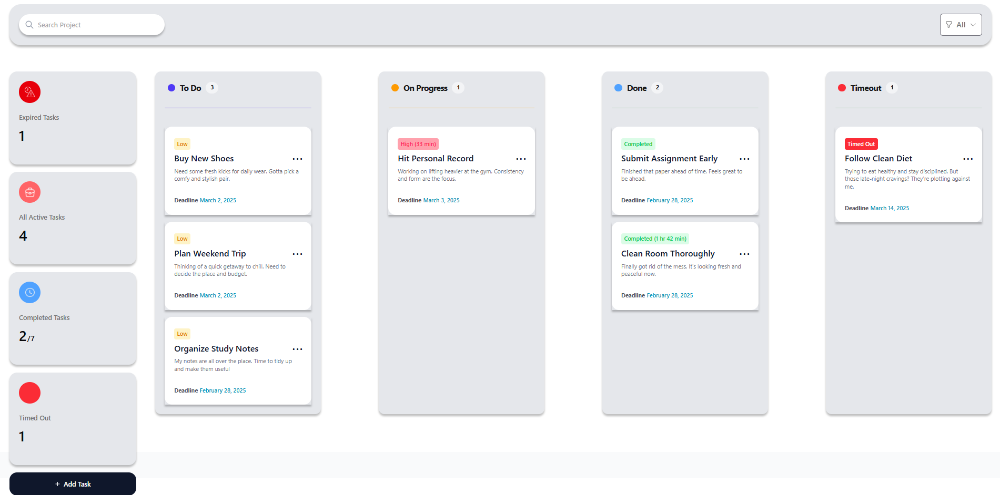

# TaskManagement - Kanban Task Management System

A modern, responsive task management application built with the MERN stack (MongoDB, Express.js, React, Node.js). This application enables users to create, organize, and track tasks using a Kanban board interface with To Do, In Progress, and Done columns.



## Features

- **Interactive Kanban Board**: Drag and drop tasks between To Do, In Progress, and Done columns
- **Task Management**: Create, edit, delete, and move tasks between statuses
- **Priority Indicators**: Visual indicators showing task priority based on column placement
- **Deadline Management**: Set and track task deadlines with an integrated calendar
- **Search & Filter**: Easily find tasks by title, description, or priority level
- **Real-time Statistics**: View dashboard statistics for expired tasks, active tasks, and completed tasks
- **Responsive Design**: Works seamlessly across desktop and mobile devices

## Tech Stack

### Frontend
- **React 19**: For building the user interface
- **Tailwind CSS 4**: For modern, utility-first styling
- **Vite**: For fast development and bundling
- **ESLint**: For code quality and consistency

### Backend
- **Node.js**: Runtime environment for the server
- **Express.js**: Web application framework
- **MongoDB**: NoSQL database for storing task data
- **Mongoose**: MongoDB object modeling for Node.js

### Development Tools
- **Nodemon**: For automatic server restarts during development
- **Cors**: For handling Cross-Origin Resource Sharing
- **React DevTools**: For debugging React applications

## Project Structure

The project follows a client-server architecture:


## API Integration

The application interacts with the backend through a RESTful API:

### Endpoints

| Method | Endpoint      | Description                       | Request Body                                   | Response                           |
|--------|---------------|-----------------------------------|------------------------------------------------|------------------------------------|
| GET    | /todos        | Fetch all tasks                   | -                                              | Array of task objects              |
| POST   | /todos        | Create a new task                 | `{title, description, deadline, status}`       | Created task object                |
| PUT    | /todos/:id    | Update a task                     | `{title?, description?, deadline?, status?}`   | Updated task object                |
| DELETE | /todos/:id    | Delete a task                     | -                                              | Status code 204 (No Content)       |

## Setup Instructions

### Prerequisites

- Node.js (v18+ recommended)
- MongoDB (v4+ recommended)
- npm or yarn package manager

### Backend Setup

1. Clone the repository
   ```bash
   git clone https://github.com/yourusername/TaskManagement.git
   cd TaskManagement
2. Install server dependencies
   ```bash
     cd server
    npm install
3. Make sure MongoDB is running on your local machine (OR) to set `MONGODB_URI` to environment variables (`./server/.env`)
   ```bash
   # To start MongoDB locally (command may vary by installation method)
    mongod
4. Start the server
   ```bash
   node index.js
    # Or with nodemon for development
    npx nodemon index.js
   
### Frontend Setup

1. Open a new terminal and navigate to the client directory
   ```bash
   cd ../client
2. Install client dependencies
   ```bash
   npm install
3. Start the development server
   ```bash
   npm run dev
  The client will run on http://localhost:5173
> NOTE: You have to set `VITE_SERVER_URI` to environment variables (`./client/.env`)


  ## MongoDB Schema

### Task Schema
    
    {
      title: String,          // Required
      description: String,    // Optional
      deadline: String,       // Optional, ISO format date
      status: String,         // Enum: 'To Do', 'On Progress', 'Done'; Default: 'To Do'
      createdAt: Date,        // Automatically added by mongoose
      updatedAt: Date         // Automatically added by mongoose
    }

### Component Structure

- **TaskDashboard**: Main container component that houses the entire application
- **SearchHeader**: Header with search and filter functionality
- **TaskStatistics**: Shows task metrics and statistics
- **KanbanBoard**: Container for the three task columns
- **KanbanColumn**: Individual column component (To Do, On Progress, Done)
- **TaskCard**: Individual task display with options menu
- **ToDoTask**: Modal form for creating new tasks
- **Calendar**: Date picker component for selecting deadlines

### Usage Guide

1. Adding Tasks: Click the "Add Task" button in the left sidebar
2. Moving Tasks: Click the three dots menu on any task card and select a status option
3. Editing Tasks: Click the three dots menu, then "Edit Task" to modify details
4. Searching: Use the search bar in the header to find tasks by title or description
5. Filtering: Use the filter dropdown to view tasks by priority level
6. Setting Deadlines: Click the "Deadline" button when creating or editing a task
